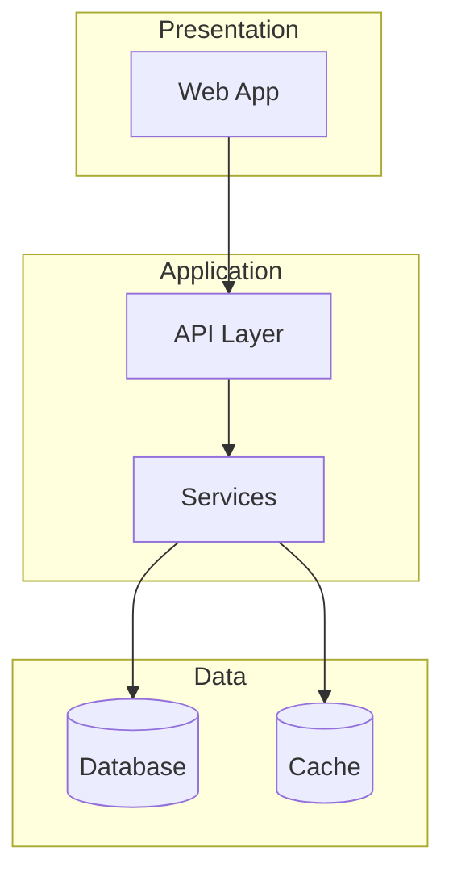

# Architecture Analysis Reference

A decision-oriented reference for analyzing and designing software architecture. Organized by analysis phase — follow the sections in order for a systematic review.

---

## 1. Incremental discovery protocol

Read in this order. Each layer reveals what to read next. Budget: ~30-50 file reads total.

### Layer 1: Manifest & Config (5-8 files)

| File | What it reveals |
|------|----------------|
| `package.json` / `go.mod` / `Cargo.toml` / `pyproject.toml` | Stack, deps, scripts, build tools |
| `tsconfig.json` / `next.config.ts` / `vite.config.ts` | Compiler settings, aliases, features |
| `docker-compose.yml` / `Dockerfile` | Container architecture, services |
| `.env.example` | External service dependencies |
| `turbo.json` / `nx.json` / `pnpm-workspace.yaml` | Monorepo setup |

### Layer 2: Structure (Glob only — zero file reads)

```
Glob: src/**/* or app/**/* (top 2 levels)
Glob: **/package.json (monorepo packages)
Glob: **/*.test.* or **/*.spec.* (test distribution)
Glob: **/Dockerfile (service boundaries)
```

### Layer 3: Data Model (1-3 files)

```
Glob: **/prisma/schema.prisma, **/drizzle/schema.ts, **/db/schema.*
Read: schema file → entities, relationships, indexes
Read: latest 2-3 migration files → recent changes
```

### Layer 4: API Surface (3-10 files)

```
Glob: **/app/api/**/route.ts, **/routes/**, **/resolvers/**
Grep: export.*(GET|POST|PUT|DELETE|PATCH) (route handlers)
Read: 2-3 representative route files
Grep: middleware|withAuth|requireAuth (auth enforcement)
```

### Layer 5: Key Source Files (5-15 files)

```
Read: entry points (app/layout.tsx, main.ts, index.ts)
Read: 3-5 largest source files (complexity magnets)
Read: shared utilities (lib/, utils/, helpers/)
Read: auth config/middleware
Read: core domain modules (most-imported files)
```

### Layer 6: Quality Signals (3-5 files + git)

```
Read: CI config (.github/workflows/*)
Read: linter config (.eslintrc, biome.json)
Read: README.md (documented architecture)
Bash: git log --since="6 months ago" --name-only --pretty=format: | sort | uniq -c | sort -rn | head -20
Bash: git shortlog -sn --since="6 months ago"
```

---

## 2. Project type classification

Classify before analyzing — the project type determines which smell catalog to use.

| Signal | Project type |
|--------|-------------|
| `next.config.*` + `app/` with `page.tsx` | Full-stack Next.js |
| `src/components/` + SPA framework, no server | Frontend SPA |
| `src/routes/` or `src/controllers/` + no frontend | Backend API |
| Multiple `services/` with separate Dockerfiles | Microservices |
| `packages/` + `apps/` with multiple frameworks | Monorepo multi-app |
| React Native / Flutter indicators | Mobile |
| Single `main.go` / `main.py` + heavy business logic | Monolith backend |

### Architecture pattern detection

| Pattern | Evidence in code |
|---------|-----------------|
| MVC | `controllers/`, `models/`, `views/` directories |
| Clean / Hexagonal | `domain/`, `adapters/`, `ports/`, `infrastructure/` |
| Feature-based | `src/users/`, `src/payments/`, `src/projects/` (grouped by domain) |
| Layer-based | `src/controllers/`, `src/services/`, `src/repositories/` (grouped by role) |
| Serverless | `functions/`, `api/`, handler-per-file pattern |
| Event-driven | `EventEmitter`, `emit()`, `on()`, pub/sub imports |
| CQRS | Separate `commands/` and `queries/` directories |

---

## 3. Detection patterns

### 3.1 Dependency graph (via Grep)

```
# JS/TS imports
Grep: ^import .+ from ['"]            → ES module imports
Grep: ^const .+ = require\(['"]       → CommonJS

# Go
Grep: ^import \(                       → Go imports

# Python
Grep: ^from\s+\w+\s+import            → Python imports

# Find most-imported internal modules (hub detection)
Grep: from ['"]@?\.\.?/               → relative imports (count targets)
```

### 3.2 Circular dependency detection

Build adjacency list from imports. For each module (top-level directory or feature directory):
1. Collect all imports to other internal modules
2. Check for direct cycles: A imports B, B imports A
3. Check for transitive cycles: A → B → C → A

### 3.3 Coupling metrics

| Metric | How to measure | Threshold |
|--------|---------------|-----------|
| Fan-in (afferent) | Count files that import this module | >15 = high (OK for infra, smell for business) |
| Fan-out (efferent) | Count modules this file imports from | >8-10 internal imports = too many concerns |
| File LOC | Line count | >500 warning, >1000 likely god module |
| Exports per file | Count exported symbols | >15-20 = doing too much |

### 3.4 Layer violation detection

1. Assign files to layers by path:
   - **Presentation**: `pages/`, `app/`, `components/`, `routes/` (handlers)
   - **Business**: `services/`, `domain/`, `use-cases/`, `features/*/logic/`
   - **Data**: `repositories/`, `models/`, `db/`, `prisma/`
   - **Infrastructure**: `config/`, `middleware/`, `utils/`, `lib/`
2. Allowed direction: Presentation → Business → Data. Infrastructure accessible by all.
3. Flag: Presentation → Data (bypassing business), Data → Presentation

### 3.5 Code smell detection (via Grep)

```
# Deep relative imports (coupling smell)
Grep: from ['"]\.\.\/\.\.\/\.\.\/     → 3+ levels up

# Hardcoded values
Grep: (localhost|127\.0\.0\.1|:3000)  → hardcoded URLs
Grep: (api_key|secret|password)\s*=\s*['"] → hardcoded secrets

# Tech debt markers
Grep: TODO|FIXME|HACK|XXX

# Suppressed warnings
Grep: eslint-disable|@ts-ignore|# type: ignore|#nosec

# Console in production
Grep: console\.(log|warn|error)       → in src/ (not tests)

# Any type usage (TS)
Grep: :\s*any\b|as\s+any\b            → type erosion

# Missing error handling
Grep: catch\s*\(\s*\w*\s*\)\s*\{\s*\} → empty catch blocks
```

### 3.6 Git analysis commands

```bash
# Top 20 hotspots (most changed files in 6 months)
git log --since="6 months ago" --name-only --pretty=format: | sort | uniq -c | sort -rn | head -20

# Directory-level hotspots
git log --since="6 months ago" --name-only --pretty=format: | sed 's|/[^/]*$||' | sort | uniq -c | sort -rn | head -20

# Bus factor per directory
git log --since="12 months ago" --format="%an" -- src/payments/ | sort -u | wc -l

# Commit conventions check
git log --oneline -20

# Fix frequency (quality signal)
git log --oneline --since="3 months ago" | grep -ci "fix\|bug\|hotfix"

# Recent activity
git log --oneline --since="1 month ago" | head -20
```

---

## 4. Smell catalogs

### 4.1 Universal smells (all project types)

| Smell | Detection | Severity |
|-------|-----------|----------|
| **Circular dependency** | Import graph cycle detection | High |
| **God module** | >500 LOC + >15 exports + high fan-in | High |
| **Missing error handling** | Empty catch blocks, unhandled promise rejections | High |
| **Hardcoded secrets** | Grep for API keys, passwords in source | Critical |
| **Dead code** | Zero fan-in files (not entry points) | Low |
| **Config sprawl** | Same value in 3+ places, no central config | Medium |
| **Deep nesting** | Functions with 4+ indent levels | Medium |
| **Dependency bloat** | 100+ production deps, multiple libs for same purpose | Medium |

### 4.2 Monolith (Node.js / Python / Go)

| Smell | Detection | Severity |
|-------|-----------|----------|
| **Big ball of mud** | No clear directory structure, files at root | Critical |
| **God service** | Service >1000 LOC with 20+ methods across domains | High |
| **Anemic domain** | Models are data-only, all logic in services | Medium |
| **Leaky abstraction** | ORM types in API responses (Prisma types in route handlers) | Medium |
| **Shared mutable state** | Global variables modified by multiple modules | High |
| **Env var sprawl** | 30+ env vars, no validation, no docs | Medium |
| **Test desert** | No test directory or <10% module coverage | High |

### 4.3 Frontend SPA (React / Vue / Svelte)

| Smell | Detection | Severity |
|-------|-----------|----------|
| **Prop drilling** | Props passed through 4+ levels | High |
| **Giant component** | Component >300 LOC mixing fetch + logic + render | High |
| **State management anarchy** | useState + useContext + Redux + Zustand mixed | Medium |
| **CSS chaos** | Mixed approaches (modules + Tailwind + styled-components) | Medium |
| **Missing loading/error** | Data-fetching without loading/error states | High |
| **Barrel file explosion** | index.ts re-exports everything, circular deps through barrels | Medium |
| **API in components** | fetch/axios directly in component files | Medium |
| **Type erosion** | Frequent `any`, `as unknown as`, untyped API responses | High |
| **No code splitting** | Single bundle, no lazy/dynamic imports | Medium |
| **Accessibility void** | No aria, no semantic HTML, click on divs | High |

### 4.4 Microservices

| Smell | Detection | Severity |
|-------|-----------|----------|
| **Distributed monolith** | Shared database, sync call chains across 3+ services | Critical |
| **Chatty communication** | One request triggers 10+ inter-service calls | High |
| **Missing circuit breaker** | HTTP calls without timeout, retry, fallback | High |
| **Shared database** | Multiple services reference same connection string | Critical |
| **No API contract** | No OpenAPI/Protobuf schemas | High |
| **Inconsistent auth** | Services implement auth differently | High |
| **Missing health checks** | No /health or /ready endpoints | Medium |
| **No log correlation** | No trace-id propagation across services | Medium |

### 4.5 Full-stack (Next.js / Rails / Django)

| Smell | Detection | Severity |
|-------|-----------|----------|
| **Fat route handler** | Route handler >100 LOC with business logic inline | High |
| **N+1 queries** | ORM relations accessed in loops without eager loading | High |
| **Auth inconsistency** | Some routes check auth, others don't | Critical |
| **Missing input validation** | No Zod/Yup schema on API inputs | High |
| **Client/server confusion** | "use client" on components that could be server components | Medium |
| **Missing security headers** | No CSP, HSTS in middleware | High |
| **Migration debt** | 50+ migrations with workaround patterns | Low |

### 4.6 Mobile (React Native / Flutter)

| Smell | Detection | Severity |
|-------|-----------|----------|
| **Platform spaghetti** | Platform.OS checks scattered throughout | Medium |
| **Navigation anarchy** | No clear navigation structure, no deep linking | High |
| **Giant screen** | Screen component >500 LOC | High |
| **Missing permissions** | Camera/location used without request flow | High |
| **Hardcoded dimensions** | Fixed pixels instead of responsive sizing | Medium |
| **No crash reporting** | No Sentry/Crashlytics integration | High |

---

## 5. C4 model mapping

### Level 1: System Context (partially inferrable)

| Source | What to extract |
|--------|----------------|
| `.env.example` | External service names (Stripe, AWS, Auth0) |
| Package deps | SDK imports → external systems |
| API routes | Incoming consumers (if documented) |
| Webhook handlers | External systems that push data in |

Output: table of external systems with direction (inbound/outbound/bidirectional) and evidence.

### Level 2: Containers (fully inferrable)

| Source | What to extract |
|--------|----------------|
| `docker-compose.yml` | Separate deployable services |
| Multiple `package.json` | Monorepo app boundaries |
| `Dockerfile` targets | Build stages → containers |
| `vercel.json` / platform config | Deployment units |
| Database config | Data stores |
| Cache config | Cache layers |

Output: Mermaid graph with subgraphs for each container.

### Level 3: Components (fully inferrable)

| Source | What to extract |
|--------|----------------|
| Top-level src/ directories | Major modules |
| Import graph | Dependencies between modules |
| Barrel exports (index.ts) | Public API of each module |
| Route groupings | Feature domains |

Output: dependency table with fan-in/fan-out + Mermaid component diagram.

### Level 4: Code (on demand only)

Too granular for proactive analysis. Generate only when user asks about a specific component.

---

## 6. ADR detection

Categories of implicit architectural decisions detectable from code:

| Category | Evidence to look for |
|----------|---------------------|
| Framework choice | Manifest dependencies, config files |
| Code organization | Feature-based vs layer-based directory structure |
| Auth strategy | JWT/session/OAuth middleware, auth library imports |
| Data access pattern | Repository classes vs direct ORM vs raw SQL |
| Error handling | Global handlers, error class hierarchy, error formats |
| API design | REST vs GraphQL vs tRPC, versioning, pagination style |
| State management | Redux vs Zustand vs Context, server state vs client state |
| Testing strategy | Test location, framework, mocking intensity, integration vs unit ratio |
| Deployment model | Dockerfile, serverless config, platform config |
| Configuration | Env vars vs config files, validation approach |

Output format per ADR:

```
| Decision | Chosen | Evidence | Consequence |
|----------|--------|----------|-------------|
| ORM | Prisma | prisma/ directory, 14 models | Type-safe queries; limited raw SQL flexibility |
```

---

## 7. Quality attributes checklist

| Attribute | Detectable? | What to check |
|-----------|-------------|---------------|
| **Maintainability** | High | Module size, coupling, naming, duplication, test presence |
| **Testability** | High | DI usage, pure functions ratio, test file coverage |
| **Deployability** | High | CI/CD config, Dockerfile, env management, feature flags |
| **Modularity** | High | Clear boundaries, low coupling, no circular deps |
| **Readability** | High | Naming, function length, nesting depth, formatting |
| **Configurability** | High | Externalized config, no hardcoded values |
| **Observability** | Medium | Logging, structured log format, error tracking, metrics |
| **Scalability** | Medium | Stateless design, connection pooling, caching, async |
| **Security** | Medium | Auth patterns, validation, secret management, headers |
| **Reliability** | Medium | Error handling, retry logic, circuit breakers, health checks |
| **Performance** | Low | N+1 patterns, missing indexes, no caching (heuristic only) |

Status values: `Good` (evidence of good practice), `Concern` (issues detected), `Unknown` (insufficient signal).

---

## 8. Architecture pattern selection (for Mode 3 — design)

| Factor | Monolith | Modular monolith | Microservices |
|--------|----------|-------------------|---------------|
| Team size | 1-5 | 3-15 | 10+ |
| Deploy independence | Not needed | Nice to have | Required |
| Domain complexity | Low-medium | Medium-high | High |
| Scale requirements | Uniform | Mostly uniform | Varies by service |
| Time to market | Fastest | Fast | Slower initially |
| Operational complexity | Low | Low-medium | High |

**Default**: start with modular monolith. Split to microservices only when independent deployment or independent scaling is required per module.

### Technology selection criteria

| Layer | Decision factors |
|-------|-----------------|
| Language/Runtime | Team skills, ecosystem maturity, performance needs |
| Framework | Community size, hiring pool, feature coverage |
| Database | Data model complexity, scale, consistency needs |
| Cache | Read/write ratio, latency requirements |
| Auth | Self-hosted vs managed, compliance requirements |
| Hosting | Team ops capacity, budget, vendor preference |

---

## 9. Output format guide

### Mermaid diagrams

Use for: dependency graphs (<30 nodes), data models, sequence flows, container diagrams.



### Dependency matrix

Use for: dense coupling analysis between modules.

```
         | auth | users | payments | db |
---------|------|-------|----------|----|
auth     |  -   |   1   |    0     | 3  |
users    |  2   |   -   |    0     | 4  |
payments |  1   |   2   |    -     | 5  |
db       |  0   |   0   |    0    |  - |
```

Highlight: circular deps (non-zero in both A→B and B→A), high fan-out (row sum), high fan-in (column sum).

### Structured tables

Use for: tech stack, smells, quality signals, ADRs, recommendations. Always include evidence column — no finding without proof.

---

## 10. Pre-send checklist

Before presenting analysis or design:

1. [ ] Project type classified correctly — smell catalog matches the architecture
2. [ ] Every finding has file path evidence — no vague claims
3. [ ] Smells ordered by severity (Critical > High > Medium > Low)
4. [ ] Diagrams paired with tables — both visual and structured data
5. [ ] Recommendations ordered by impact with concrete next steps
6. [ ] Tradeoffs stated for every recommendation — what's gained and what's traded
7. [ ] Git analysis included (if history available) — hotspots, ownership, churn
8. [ ] Context budget respected — read 30-50 files max, not the entire codebase
9. [ ] No false confidence — unknown areas marked as "Unknown" or "Insufficient signal"
10. [ ] In Mode 1: generated skill references actual project paths, not generic templates
11. [ ] In Mode 3: every technology choice justified with tradeoffs
12. [ ] Diagrams use Mermaid with <30 nodes — larger graphs aggregated to higher level
